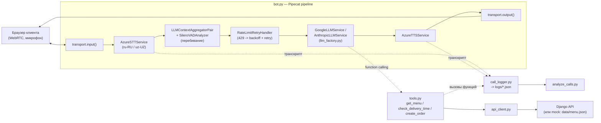

# Voice AI — голосовой бот приёма заказов еды

Демо-проект: клиент звонит через браузер (WebRTC, без телефонного номера), бот
на узбекском или русском языке принимает заказ — уточняет блюда, количество,
адрес и время доставки, отвечает на вопросы и создаёт заказ через Django API
(или в mock-режиме, если Django ещё не готов).

Собрано на [Pipecat](https://github.com/pipecat-ai/pipecat) 1.11.0, Azure
Speech (STT/TTS), Gemini или Claude (переключается в `.env`), Silero VAD с
перебиванием.

[](https://github.com/ZiyoYunusov/Voice-AI/actions/workflows/tests.yml)

## Установка и запуск

Нужен Python 3.11+.

```bash
python -m venv .venv
.venv\Scripts\activate
pip install -r requirements.txt
copy .env.example .env
```

Откройте `.env` и заполните ключи (см. раздел ниже), затем запустите:

```bash
python bot.py -t webrtc
```

Откройте в браузере **http://localhost:7860/client** — там будет кнопка
подключения к звонку. Разрешите доступ к микрофону и говорите.

## Откуда взять ключи

- **Google AI Studio (Gemini, провайдер по умолчанию)** — зайдите на
  [aistudio.google.com/apikey](https://aistudio.google.com/apikey), создайте
  ключ, вставьте в `GOOGLE_API_KEY`. Бесплатный тариф Flash-моделей достаточен
  для демо.
- **Azure Speech (STT + TTS, обязательно в любом случае)** — создайте ресурс
  "Speech service" в [портале Azure](https://portal.azure.com), тариф **F0**
  (бесплатный). В разделе "Keys and Endpoint" возьмите ключ (`AZURE_SPEECH_API_KEY`)
  и регион (`AZURE_SPEECH_REGION`, например `westeurope`).
- **Anthropic Console (опционально, если хотите LLM_PROVIDER=anthropic)** —
  [console.anthropic.com](https://console.anthropic.com), создайте ключ,
  вставьте в `ANTHROPIC_API_KEY`.

## Как переключить язык и LLM-провайдера

Всё через `.env`, без правок кода:

```dotenv
BOT_LANGUAGE=ru        # или uz
LLM_PROVIDER=gemini    # или anthropic
GEMINI_MODEL=gemini-3.6-flash
ANTHROPIC_MODEL=claude-haiku-4-5-20251001
```

Голос Azure для каждого языка тоже настраивается в `.env`
(`AZURE_VOICE_RU`, `AZURE_VOICE_UZ`) — по умолчанию женские голоса
(`ru-RU-SvetlanaNeural`, `uz-UZ-MadinaNeural`), в комментариях рядом —
мужские варианты (`ru-RU-DmitryNeural`, `uz-UZ-SardorNeural`).

## Подключение своего Django API

По умолчанию `DJANGO_API_URL` пуст — бот работает в mock-режиме на
`data/menu.json`, заказы логируются, но никуда не отправляются. Чтобы
подключить реальный бэкенд, задайте `DJANGO_API_URL` (и `DJANGO_API_TOKEN`,
если нужна авторизация Bearer) — `api_client.py` начнёт ходить в API вместо
mock-режима. Ожидаемые эндпоинты:

**`GET /api/menu/`** → `200 OK`, тело — список блюд:

```json
[
  {"id": "plov", "name": "Ош (плов)", "name_uz": "Osh (palov)", "category": "main", "price": 35000, "description": "..."}
]
```

**`POST /api/delivery-estimate/`**, тело `{"address": "..."}` → `200 OK`:

```json
{"estimated_minutes": 40}
```

**`POST /api/orders/`**, тело:

```json
{
  "items": [{"item_id": "plov", "quantity": 2}],
  "address": "Ташкент, Чиланзар 5",
  "phone": "+998901234567",
  "delivery_time": "к 19:00"
}
```

→ `201/200 OK`:

```json
{
  "order_id": "12345",
  "status": "created",
  "total_price": 70000,
  "estimated_delivery_minutes": 45,
  "items": [{"item_id": "plov", "name": "Ош (плов)", "quantity": 2, "price": 35000}]
}
```

Любой `429`/`5xx` или таймаут — `api_client.py` сам повторит запрос до 3 раз с
экспоненциальной задержкой, прежде чем сообщить об ошибке боту.

## Анализ звонков

Каждый звонок пишется в `logs/<call_id>.json` (транскрипт, вызванные функции,
итог — заказ создан / отказ / обрыв, длительность, LLM-провайдер). Посчитать
метрики:

```bash
python analyze_calls.py
```

Выведет конверсию в заказ, среднюю длительность, частые точки отказа
(последняя реплика бота в незавершённых звонках) и сравнение провайдеров
Gemini/Claude, если в логах есть звонки от обоих.

## Тесты

```bash
pytest
```

Покрыты `tools.py`, `api_client.py` (mock-режим и ретраи) и `llm_factory.py`
(выбор провайдера и модели).

## Архитектура



Транспорт — `SmallWebRTCTransport` (браузер, без телефонии). Чтобы позже
добавить Twilio, в `bot.py` достаточно дописать в словарь `transport_params`
ключ `"twilio": lambda: FastAPIWebsocketParams(...)` — `create_transport()`
сам выберет нужный транспорт по типу `runner_args`, остальной код бота
трогать не нужно.

## Что нужно сделать руками перед первым звонком

1. Установить зависимости: `pip install -r requirements.txt`.
2. `copy .env.example .env` и заполнить:
   - `AZURE_SPEECH_API_KEY`, `AZURE_SPEECH_REGION` — обязательно (STT и TTS).
   - `GOOGLE_API_KEY` — обязательно, если `LLM_PROVIDER=gemini` (по умолчанию).
   - `ANTHROPIC_API_KEY` — обязательно, только если переключите `LLM_PROVIDER=anthropic`.
   - `DJANGO_API_URL` — можно оставить пустым, тогда заказы будут создаваться
     в mock-режиме на `data/menu.json`.
3. Выбрать язык в `BOT_LANGUAGE` (`ru` или `uz`).
4. Запустить `python bot.py -t webrtc`, открыть `http://localhost:7860/client`,
   разрешить браузеру доступ к микрофону.
5. После разговора проверить `logs/` — там появится JSON с этим звонком, и
   `python analyze_calls.py` покажет метрики.

## Лицензия

[MIT](LICENSE)
